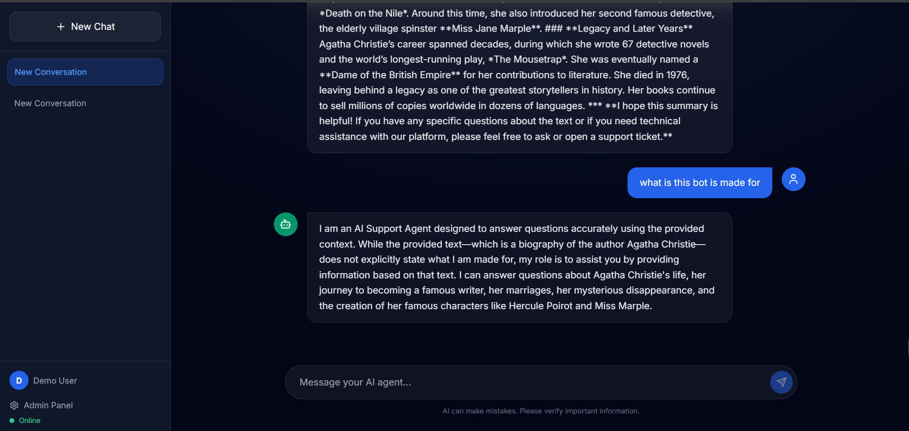
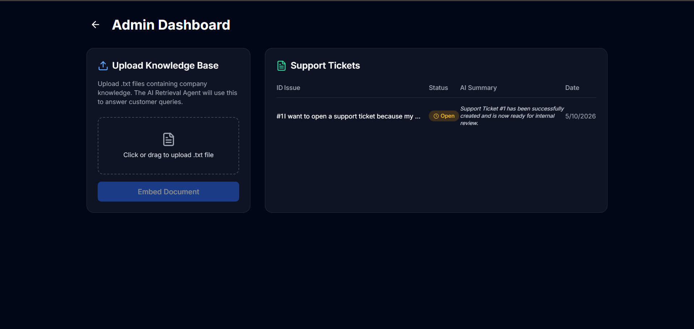

# Agentic AI Customer Success Platform

An enterprise-grade, autonomous Customer Success SaaS platform powered by multiple AI agents. This platform leverages LangGraph, FastAPI, FAISS, and local open-source LLMs (Ollama) to autonomously classify intents, retrieve knowledge base articles, answer queries, create support tickets, and summarize interactions.

## Features

- **Multi-Agent Orchestration (LangGraph)**:
  - 🚦 **Routing Agent**: Intelligently classifies user intent to route to the correct agent.
  - 📚 **Retrieval Agent**: Searches FAISS vector store for relevant enterprise knowledge.
  - 💬 **Support Agent**: Handles general inquiries using RAG and memory.
  - 🛠️ **Action Agent**: Autonomously executes actions like creating support tickets.
  - 📝 **Summarization Agent**: Condenses ticket threads for human admin review.
- **Local AI Stack**: Uses **Ollama** (Phi-3/Mistral) and Hugging Face Embeddings for 100% free, private inference.
- **RAG & Semantic Search**: FAISS vector database for sub-second knowledge retrieval.
- **Enterprise UI**: Premium glassmorphic interface built with React, Vite, and Tailwind CSS.
- **Admin Dashboard**: Manage support tickets and upload `.txt` knowledge base files for instant embedding.
- **Authentication**: JWT-based secure login and user sessions.

## Architecture

The system utilizes a cyclic LangGraph state machine. Every user message updates the state, passes through the **Router**, and is directed to the appropriate specialized agent.

```
User Message ──> Router ──┬──> Knowledge Query ──> Retrieval ──> Support Agent
                          ├──> Issue/Bug ──> Action Agent (Creates Ticket) ──> Summarization Agent
                          └──> General Chat ──> General Agent
```

## Folder Structure

```
saas-agentic-bot/
├── backend/
│   ├── agents/          # LangChain agents (Routing, Support, Action...)
│   ├── api/             # FastAPI routes (Auth, Chat, Admin)
│   ├── auth/            # JWT authentication logic
│   ├── database/        # SQLite models and connection
│   ├── models/          # LLM wrappers (Ollama)
│   ├── schemas/         # Pydantic validation schemas
│   ├── vectorstore/     # FAISS setup and document processing
│   ├── workflows/       # LangGraph state and graph compilation
│   └── main.py          # FastAPI application entry point
├── frontend/
│   ├── src/
│   │   ├── components/  # React components (Auth, ChatInterface, AdminDashboard)
│   │   ├── services/    # Axios API client
│   │   ├── App.jsx      # React Router
│   │   └── index.css    # Tailwind CSS and Glassmorphism utilities
│   ├── package.json
│   └── tailwind.config.js
└── docker-compose.yml   # (Optional) Containerization
```

## Installation Guide

### Prerequisites
- Python 3.10+
- Node.js 18+
- [Ollama](https://ollama.com/) installed locally.

### 1. Start Local LLM
Ensure Ollama is running and pull your preferred model (default is `phi3`):
```bash
ollama run phi3
```

### 2. Backend Setup
Navigate to the `backend` directory, create a virtual environment, and start the FastAPI server:
```bash
cd backend
python -m venv venv
# On Windows: venv\Scripts\activate
# On Mac/Linux: source venv/bin/activate
pip install -r requirements.txt

uvicorn main:app --reload
```
The backend API will be available at `http://localhost:8000`.

### 3. Frontend Setup
Navigate to the `frontend` directory, install dependencies, and start the Vite development server:
```bash
cd frontend
npm install
npm run dev
```
The application will be available at `http://localhost:5173`.

## Usage Instructions

1. **Sign Up**: Create an account via the beautifully designed glassmorphic login screen. 
2. **Make Admin**: By default, new users are standard users. To access the admin panel, you'll need to manually set `is_admin=1` in the SQLite database (`sql_app.db` -> `users` table) for your account.
3. **Upload Knowledge**: Once admin, go to the **Admin Dashboard** and upload `.txt` files containing FAQ or product knowledge.
4. **Chat**: Return to the chat interface. Ask questions, and the agent will retrieve from the uploaded knowledge. Tell it you have an issue or want to open a ticket, and the **Action Agent** will autonomously generate a ticket, which the **Summarization Agent** will then summarize.

## Screenshots





## Future Improvements

- Migrate to PostgreSQL and pgvector for production deployments.
- Add WebSockets for token-by-token streaming responses.
- Implement Celery workers for asynchronous document chunking and embedding.
- Integrate with real external APIs (Jira, Zendesk) via the Action Agent.
